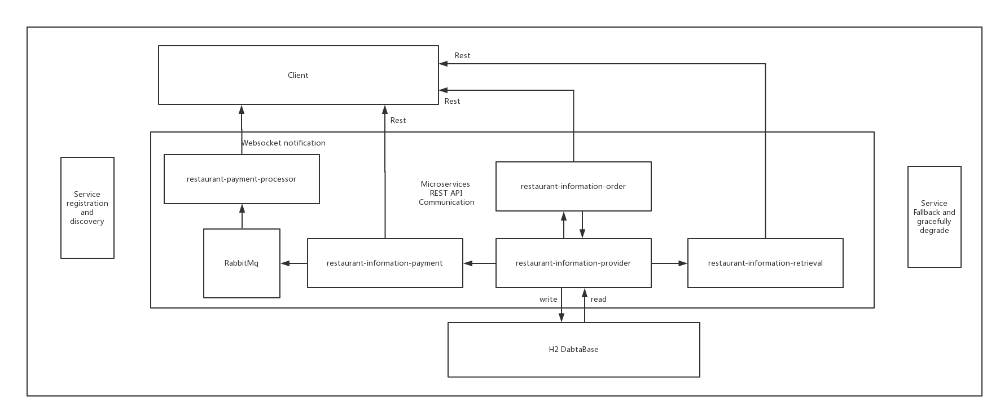

# restaurant-order-system
restaurant-order-system is a back end web microservice system, using Java,
Spring Boot, Spring Data, Spring Cloud, RabbitMQ and H2.

#### System disign:


#### Services:
* RabbitMQ: process payment asynchronously for preventing a hard handling with too many orders  

* Eureka: services registration and discovery

* Hystrix: services fall and gracefully degrade

* restaurant-information-provider : provide restaurant information, item information, order information for other services and do R/W for Database

* restaurant-information-retrieval: search restaurants by name and items

* restaurant-items-order: order items clients select

* restaurant-items-payment: pay items by providing Credit Card information

* restaurant-payment-processor: confirm payment information and notify client the success or failure of payment
## Getting Started

These instructions will get you a copy of the project up and running on your local machine for development and testing purposes.

### Prerequisites


```
Java JDK 1.8
Maven
Docker
```

### Installing

Change your current Location to restaurant-order-system</br>
```
$ cd ../restaurant-order-system
```
Create executable jar files
```
$ mvn clean install
```
Go into target and run jar files, in turn, by above Services' introduction order.

```
$ java -jar [jar file]
```

## Running the tests

#### Automation Test
Integration test and MockMvc test run automatically while building jar files.

#### Manual Test
Use Google App Postman and  to test
* restaurant-information-provider test :
  1. set Postman's Http method as Post

  2. input url: http://localhost:8080/restaurantInfo

  3. upload restaurant information data from restaurantInfo.json

  4. return restaurant information

* restaurant-information-retrieval test:
  1. set Postman's Http method as Get

  2. input url: http://localhost:8088/restaurantName/{name}

  3. get items of restaurant's name containing {name}

* restaurant-items-order test:
  1. set Postman's Http method as Post

  2. input url: http://localhost:9006/items/order/

  3. upload clients' requests such as note, account, address from orderInfo.json

  4. data will be saved in database and return order information

* restaurant-items-payment test:
  1. set Postman's Http method as Post

  2. input url: http://localhost:9007/checkout/

  3. upload Clients' credit card information from bankInfo.json

  4. data will be saved in database and return payment information

* restaurant-payment-processor test:
  1. check database if orderInfo's isPaid field is set true
